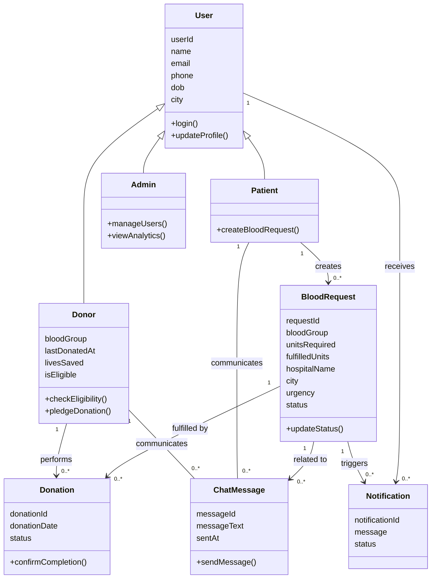

```mermaid
classDiagram
    class User {
        userId
        name
        email
        phone
        dob
        city
        +login()
        +updateProfile()
    }

    class Donor {
        bloodGroup
        lastDonatedAt
        livesSaved
        isEligible
        +checkEligibility()
        +pledgeDonation()
    }

    class Patient {
        +createBloodRequest()
    }

    class Admin {
        +manageUsers()
        +viewAnalytics()
    }

    class BloodRequest {
        requestId
        bloodGroup
        unitsRequired
        fulfilledUnits
        hospitalName
        city
        urgency
        status
        +updateStatus()
    }

    class Donation {
        donationId
        donationDate
        status
        +confirmCompletion()
    }

    class ChatMessage {
        messageId
        messageText
        sentAt
        +sendMessage()
    }

    class Notification {
        notificationId
        message
        status
    }

    User <|-- Donor
    User <|-- Patient
    User <|-- Admin

    Patient "1" --> "0..*" BloodRequest : creates
    Donor "1" --> "0..*" Donation : performs
    BloodRequest "1" --> "0..*" Donation : fulfilled by

    Donor "1" -- "0..*" ChatMessage : communicates
    Patient "1" -- "0..*" ChatMessage : communicates
    BloodRequest "1" --> "0..*" ChatMessage : related to

    BloodRequest "1" --> "0..*" Notification : triggers
    User "1" --> "0..*" Notification : receives
```
